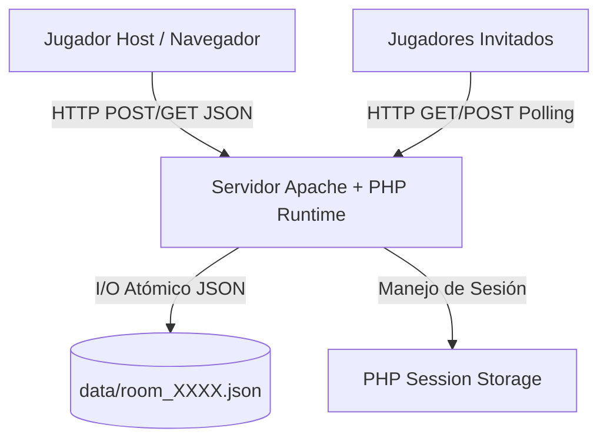
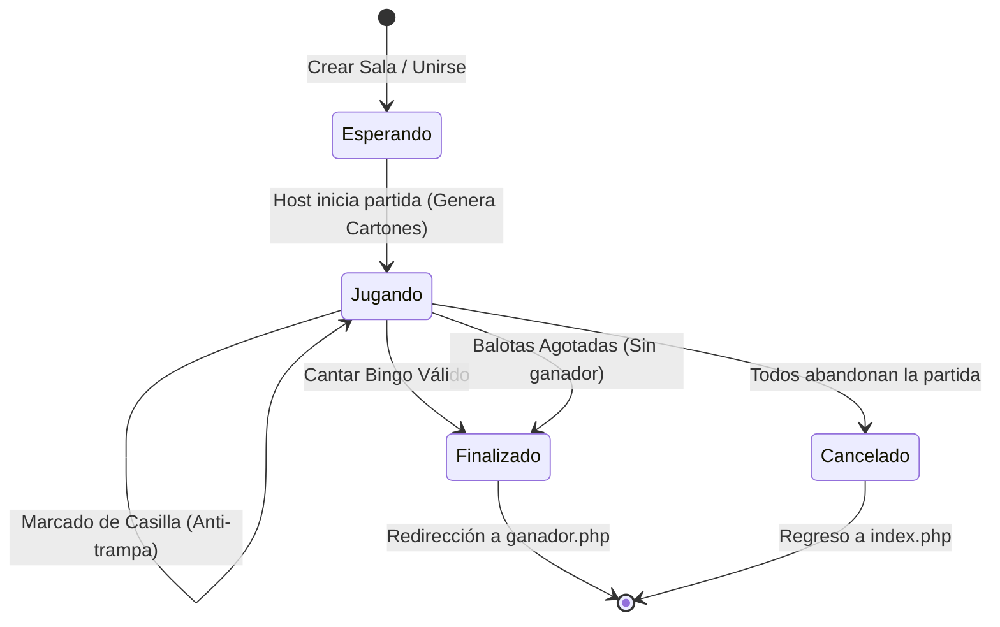

# Documento de Especificación de Requisitos de Software (SRS)
## Proyecto: Sistema de Bingo Online Multijugador en Tiempo Real

---

**Estándar de referencia:** Adaptado de IEEE 830 / ISO/IEC/IEEE 29148  
**Versión del documento:** 1.0.0  
**Fecha:** Septiembre 2026  
**Estado:** Aprobado / Línea Base  
**Sistema objetivo:** Aplicación Web de Bingo Multijugador (`bingo_mod`)

---

## 1. Introducción

### 1.1 Propósito
El presente documento de **Especificación de Requisitos de Software (SRS)** tiene como objetivo definir de forma completa, precisa y formal los requisitos funcionales, no funcionales, reglas de negocio, interfaces y restricciones arquitectónicas del sistema **Bingo Online Multijugador**. Este documento sirve como contrato técnico de referencia para desarrolladores, evaluadores de calidad (QA), administradores de sistemas y partes interesadas.

### 1.2 Alcance del Sistema
El sistema es una plataforma web ligera y reactiva para el juego de Bingo en tiempo real con arquitectura cliente-servidor basada en PHP y JavaScript. Permite a los usuarios crear salas privadas protegidas por código, unirse a partidas existentes, participar simultáneamente con cartones generados dinámicamente, recibir balotas automáticas sincronizadas, cantar Bingo con validación estricta en servidor y gestionar el ciclo de vida de las partidas sin requerir instalación de bases de datos relacionales complejas (utiliza persistencia JSON atomizada).

### 1.3 Definiciones, Acrónimos y Abreviaturas
- **SRS:** Software Requirements Specification (Especificación de Requisitos de Software).
- **Host (Anfitrión):** Jugador que crea una sala y posee privilegios para configurar la velocidad, el modo de juego e iniciar la partida.
- **Balota / Ficha:** Unidad de juego identificada por una letra (`A, B, C, D, E`) y un número de dos dígitos (`00-99`).
- **Cartón:** Matriz bidimensional de 5x5 celdas con 25 fichas únicas asignadas a un jugador.
- **Polling:** Técnica de comunicación cliente-servidor donde el navegador realiza peticiones HTTP periódicas para sincronizar el estado.
- **JSON:** JavaScript Object Notation (formato de almacenamiento y transporte de datos).
- **Sanitización:** Proceso de limpieza de entradas del usuario para prevenir ataques XSS e inyecciones de código.

### 1.4 Referencias
- Estándar IEEE Std 830-1998 (*IEEE Recommended Practice for Software Requirements Specifications*).
- Estándar ISO/IEC/IEEE 29148:2018 (*Systems and software engineering — Life cycle processes — Requirements engineering*).
- Especificación técnica de PHP 7.4 / 8.x Core.
- Estándar W3C HTML5, ECMAScript 6+ y CSS3.

---

## 2. Descripción General del Producto

### 2.1 Perspectiva del Producto
El sistema **Bingo Online** opera de forma autónoma dentro de un servidor web con soporte PHP (Apache/Nginx en entornos locales como XAMPP o servidores en la nube). 



### 2.2 Características de los Usuarios
- **Usuario Invitado (Jugador):** Puede ingresar al sistema, unirse a una sala mediante código de 4 caracteres, interactuar con su cartón marcando casillas y cantar Bingo cuando complete un patrón válido.
- **Usuario Creador (Host):** Además de jugar, tiene privilegios administrativos sobre la sala: configuración del modo de nomenclatura (Normal vs. Reducido), ajuste del intervalo de extracción de balotas (5s, 10s, 15s) e inicio formal de la partida.

### 2.3 Entorno Operativo
- **Servidor:** Servidor HTTP (Apache 2.4+ o Nginx) con PHP 7.4 o PHP 8.x con extensiones `json`, `session` y permisos de escritura en la carpeta `data/`.
- **Cliente:** Navegadores web modernos (Google Chrome 90+, Mozilla Firefox 88+, Safari 14+, Microsoft Edge 90+) compatibles con CSS Grid, Flexbox, Fetch API, Audio API y Clipboard API.
- **Dispositivos:** Responsive Web Design compatible con pantallas de escritorio, portátiles, tablets y smartphones.

### 2.4 Restricciones de Diseño e Implementación
1. **Persistencia Ligera:** El almacenamiento de salas se realiza en archivos JSON independientes dentro del directorio `data/` bajo el formato `room_<CODIGO>.json`.
2. **Acceso Seguro a Datos:** Bloqueo de archivos mediante `LOCK_EX` (`file_put_contents`) para evitar condiciones de carrera (*race conditions*) y protección del directorio `data/` mediante directivas de servidor `.htaccess`.
3. **Control de Estado Stateless/Session:** La identidad de cada jugador se mantiene mediante variables de sesión PHP (`$_SESSION['jugador_id']`, `$_SESSION['codigo_sala']`, `$_SESSION['jugador_nombre']`).
4. **Sincronización:** Actualización en tiempo real gestionada mediante sondeo continuo (*HTTP Long Polling / Interval Polling*) a intervalos optimizados de 2.5 a 3.0 segundos.

---

## 3. Requisitos de Interfaces Externas

### 3.1 Interfaces de Usuario (UI/UX)
El sistema presenta cuatro interfaces principales desarrolladas bajo estética moderna con temática oscura (Dark/Green Velvet Casino Glassmorphism):

1. **Pantalla de Inicio (`index.php`):**
   - Selector de pestañas ("Crear sala" / "Unirse").
   - Formulario de creación: campos para nombre del jugador (máx. 20 caracteres) y nombre de la sala (máx. 30 caracteres).
   - Formulario de unión: campo de nombre y campo de código de 4 caracteres con auto-capitalización y espaciado de tracking.
   - Mensajes de validación y alerta en línea.

2. **Sala de Espera / Lobby (`espera.php`):**
   - Encabezado con nombre de sala y badge de código de sala copiable al portapapeles con feedback visual.
   - Lista dinámica de jugadores con avatares calculados a partir de iniciales, badges de rol ("Host" / "Tú").
   - Panel de control exclusivo para el Host:
     - Selector de velocidad de balotas: Rápido (5s), Normal (10s), Lento (15s).
     - Selector de modo de nomenclatura: Normal (A00-E99) vs. Reducido (rangos segmentados).
     - Botón de "Iniciar partida" condicionado a quorum de jugadores.
   - Panel de espera para jugadores con animación de puntos suspensivos.
   - Botón de "Salir de la sala".
   - Feedback auditivo al arrancar la partida.

3. **Tablero de Juego Principal (`juego.php`):**
   - **Indicador de Balota Actual:** Visualización esférica en 3D con anillo de color asociado a la letra (`A: Azul`, `B: Verde`, `C: Amarillo`, `D: Rojo`, `E: Morado`), letra y número en tipografía de alto impacto.
   - **Barra de Temporizador:** Indicador de progreso decreciente con cambio dinámico de color (Azul -> Amarillo -> Rojo) según el tiempo restante para la siguiente balota.
   - **Historial de Fichas:** Tira horizontal y envolvente con las últimas balotas sorteadas.
   - **Cartón Interactivo:** Matriz de 5x5 celdas con cabeceras de columnas identificadas por colores temáticos. Celdas reactivas con estados hover, activa, marcada y animación de error (*shake*) si se intenta marcar una ficha aún no extraída.
   - **Panel Lateral:** Lista de jugadores en tiempo real con indicador de presencia (*status dot*), botón central "¡BINGO!", panel de modificación de velocidad en vivo para el Host, y botón "Abandonar partida" con confirmación de seguridad en dos toques.
   - **Overlays Modales:** Overlay de cancelación de partida (cuando todos abandonan) y overlay de victoria con redirección a podio.
   - **Efectos de Sonido Integrados:** Balota nueva, marcado de ficha, aviso de bingo y fanfarria de ganador.

4. **Pantalla de Ganador (`ganador.php`):**
   - Trofeo central animado (*popIn*).
   - Nombre del jugador triunfador destacado.
   - Generación procedimental de confeti animado en CSS/JS (80 partículas con trayectorias y rotaciones dinámicas).
   - Botón de retorno al inicio con limpieza de `sessionStorage`.

### 3.2 Interfaces de Software y Endpoints (API REST/JSON)

| Endpoint | Método | Parámetros Entrada | Respuesta / Salida | Descripción |
| :--- | :--- | :--- | :--- | :--- |
| `php/crear_sala.php` | `POST` | `nombre`, `nombre_sala` (JSON) | `{"ok":true, "codigo":"XXXX"}` | Inicializa la estructura de la sala y sesión del Host. |
| `php/unirse_sala.php` | `POST` | `nombre`, `codigo` (JSON) | `{"ok":true, "codigo":"XXXX"}` | Valida existencia, capacidad y estado, y añade al jugador. |
| `php/iniciar_partida.php` | `POST` | `codigo`, `velocidad`, `modo` (JSON) | `{"ok":true}` | Genera cartones individuales y cambia estado a `jugando`. |
| `php/verificar_estado.php` | `GET` | `accion=estado&codigo=XXXX` | `{"ok":true, "sala":{...}}` | Retorna estado de sala, historial, balota y dispara cronómetro. |
| `php/verificar_estado.php` | `GET` | `accion=carton&codigo=XXXX` | `{"ok":true, "grid":[[...]], "marcadas":[...]}` | Retorna la cuadrícula 5x5 y fichas marcadas del jugador. |
| `php/verificar_estado.php` | `POST` | `accion=marcar`, `codigo`, `valor` (JSON) | `{"ok":true}` | Valida y persiste la casilla marcada por el jugador. |
| `php/verificar_estado.php` | `POST` | `accion=salir`, `codigo` (JSON) | `{"ok":true}` | Gestiona el abandono del jugador, reasigna host o cancela. |
| `php/cambiar_velocidad.php`| `POST` | `codigo`, `velocidad` (JSON) | `{"ok":true, "intervalo_fichas":N}` | Actualiza el intervalo de tiempo entre fichas en vivo. |
| `php/cantar_bingo.php` | `POST` | `codigo` (JSON) | `{"ok":true, "ganador":true, "nombre_ganador":"..."}` | Ejecuta el algoritmo de validación de victoria en servidor. |

---

## 4. Requisitos Funcionales



### Módulo 1: Gestión de Salas y Participantes
- **RF-01: Creación de Sala**
  - **Descripción:** El sistema debe permitir a cualquier usuario crear una nueva sala especificando su nombre y el nombre descriptivo de la sala.
  - **Entradas:** `nombre` (string, 1-20 caracteres), `nombre_sala` (string, 1-30 caracteres).
  - **Procesamiento:**
    1. Sanitizar cadenas de texto eliminando etiquetas HTML y espacios redundantes.
    2. Generar un código alfanumérico único de 4 caracteres (excluyendo caracteres ambiguos como `0, O, 1, I`).
    3. Asignar al creador un ID de 16 caracteres hexadecimales generado criptográficamente (`random_bytes(8)`).
    4. Crear el archivo de sala `room_<CODIGO>.json` con estado `esperando` y establecer variables de sesión.
  - **Salidas:** Código de sala generado y redirección a `espera.php`.

- **RF-02: Unión a Sala Existente**
  - **Descripción:** El sistema debe permitir a un usuario unirse a una sala activa mediante su código único.
  - **Entradas:** `nombre` (string, 1-20 caracteres), `codigo` (string, 4 caracteres alfanuméricos).
  - **Reglas de Negocio:**
    - La sala debe existir en el directorio `data/`.
    - La sala debe encontrarse estrictamente en estado `esperando`.
    - La sala no debe superar el límite máximo de 20 jugadores concurrentes.
  - **Salidas:** Registro del jugador en el archivo de sala y redirección a `espera.php`.

- **RF-03: Sala de Espera y Sincronización de Jugadores**
  - **Descripción:** La sala de espera debe actualizar de forma asíncrona la lista de jugadores conectados y el estado de la sesión cada 2.5 segundos.
  - **Reglas de Negocio:**
    - Si el estado de la sala cambia a `jugando`, todos los participantes deben reproducir el sonido de inicio y ser redirigidos automáticamente a `juego.php`.
    - Si la sala es eliminada o el código es inválido, redirigir a `index.php`.

- **RF-04: Reasignación de Host y Abandono en Lobby**
  - **Descripción:** Si un jugador abandona la sala de espera:
    - Si era el Host y quedan otros jugadores, el rol de Host se transfiere automáticamente al siguiente jugador de la lista.
    - Si era el único jugador, el archivo de la sala es eliminado inmediatamente del servidor.

### Módulo 2: Configuración y Generación de Partida
- **RF-05: Modos de Nomenclatura**
  - **Descripción:** El sistema debe soportar dos esquemas de distribución de balotas:
    1. **Modo Normal:** Rango completo `00` al `99` para cada una de las 5 columnas (`A00-A99`, `B00-B99`, `C00-C99`, `D00-D99`, `E00-E99`), totalizando 500 fichas posibles.
    2. **Modo Reducido:** Rango segmentado por columnas para acelerar la partida:
       - Columna A: `00` a `19` (20 fichas).
       - Columna B: `20` a `39` (20 fichas).
       - Columna C: `40` a `59` (20 fichas).
       - Columna D: `60` a `79` (20 fichas).
       - Columna E: `80` a `99` (20 fichas).
       - Total: 100 fichas posibles.
  - **Regla de Negocio:** Si una partida inicia con menos de 5 jugadores, el sistema aplica automáticamente el *Modo Reducido* para garantizar dinamismo.

- **RF-06: Generación Dinámica de Cartones**
  - **Descripción:** Al iniciar la partida, el servidor debe generar un cartón 5x5 único para cada jugador conectado.
  - **Reglas de Negocio:**
    - Cada columna $j \in \{A, B, C, D, E\}$ debe contener 5 números aleatorios sin repetición dentro del rango configurado para dicha letra.
    - Los cartones se almacenan bajo la clave `cartones[jugador_id]` en la estructura de la sala con su lista de `marcadas` inicialmente vacía.

- **RF-07: Configuración de Velocidad de Extracción**
  - **Descripción:** El Host puede seleccionar la cadencia de extracción de balotas entre tres opciones: 5 segundos (Rápido), 10 segundos (Normal) y 15 segundos (Lento). Esta configuración puede modificarse tanto en el lobby como en plena partida.

### Módulo 3: Dinámica de Juego y Balotas
- **RF-08: Motor de Extracción Automática de Balotas**
  - **Descripción:** El servidor debe extraer y publicar una nueva balota de forma determinista y sincronizada.
  - **Procesamiento:**
    1. Verificar si el timestamp actual `time()` es mayor o igual a `proxima_ficha_at`.
    2. Calcular el conjunto de fichas disponibles $D = \text{todasLasFichas}(\text{modo}) \setminus \text{historial}$.
    3. Si $D = \emptyset$, finalizar la partida declarando empate ("Nadie - fichas agotadas").
    4. En caso contrario, seleccionar aleatoriamente una ficha de $D$, agregarla al `historial` y calcular el siguiente timestamp `proxima_ficha_at = time() + intervalo`.
  - **Salidas:** Balota añadida al historial y notificada a los clientes en el siguiente ciclo de polling.

- **RF-09: Marcado de Casillas y Validación Anti-Trampas**
  - **Descripción:** El jugador puede hacer clic en cualquier celda de su cartón para marcarla.
  - **Reglas de Seguridad y Validación:**
    - El valor enviado debe cumplir con la expresión regular `/^[ABCDE][0-9]{2}$/`.
    - La ficha debe haber sido extraída previamente (debe existir dentro de `sala['historial']`).
    - La ficha debe pertenecer obligatoriamente al cartón generado para ese jugador.
    - Si la validación falla, el servidor rechaza la solicitud con error y el cliente aplica una animación de sacudida (*shake effect*).
    - Si es válida, la ficha se añade a `sala['cartones'][jugador_id]['marcadas']`.

### Módulo 4: Validación de Victoria y Finalización
- **RF-10: Verificación Rigurosa de Bingo**
  - **Descripción:** Cuando un jugador pulsa el botón "¡BINGO!", el servidor valida exhaustivamente la condición de victoria.
  - **Algoritmo de Validación:**
    1. **Validación de Integridad:** Comprobar que todas las fichas en `carton['marcadas']` pertenezcan a `sala['historial']`.
    2. **Validación Geométrica 5x5:**
       - **5 Filas:** Existe al menos una fila $i \in [0,4]$ tal que las 5 celdas $\{(c, i) \mid c \in [0,4]\} \subseteq \text{marcadas}$.
       - **5 Columnas:** Existe al menos una columna $c \in [0,4]$ tal que las 5 celdas $\{(c, i) \mid i \in [0,4]\} \subseteq \text{marcadas}$.
       - **Diagonal Principal:** Las 5 celdas $\{(0,0), (1,1), (2,2), (3,3), (4,4)\} \subseteq \text{marcadas}$.
       - **Diagonal Secundaria:** Las 5 celdas $\{(0,4), (1,3), (2,2), (3,1), (4,0)\} \subseteq \text{marcadas}$.
    3. Si se cumple alguna condición, la partida cambia inmediatamente a estado `finalizado`, se registra el `ganador_id`, `ganador_nombre` y timestamp `finalizado_at`.
    4. Si no cumple, se retorna un mensaje de error ("Bingo inválido – necesitas una fila, columna o diagonal completa").

- **RF-11: Transición a Pantalla de Ganador**
  - **Descripción:** Al detectarse el fin de la partida, todos los clientes en polling reciben el estado `finalizado` y muestran el overlay de victoria con redirección a `ganador.php`.

- **RF-12: Abandono de Partida y Cancelación Automática**
  - **Descripción:** Si un jugador abandona la partida en curso:
    - Se le marca como `ausente: true`.
    - Si todos los jugadores quedan marcados como ausentes, la partida pasa automáticamente a estado `cancelado` y los recursos quedan listos para purga.

- **RF-13: Recolección de Basura y Limpieza Automática**
  - **Descripción:** El sistema debe ejecutar una rutina de limpieza (`limpiarSalaExpirada`) que elimine físicamente los archivos de salas finalizadas o canceladas una vez transcurridos 60 segundos posteriores a su culminación.

---

## 5. Requisitos No Funcionales (NFR)

### 5.1 Rendimiento y Eficiencia
- **R-01 (Tiempo de Respuesta):** Los endpoints de la API deben responder en menos de 80 ms en condiciones de red local/servidor estándar.
- **R-02 (Carga de Polling Reducida):** Las respuestas JSON de polling deben contener únicamente la información del estado actual requerida (peso promedio de payload < 2 KB).
- **R-03 (Concurrencia):** Soporte para múltiples salas simultáneas sin interferencia mutua gracias a la segmentación de archivos por sala.

### 5.2 Seguridad y Protección de Datos
- **S-01 (Sanitización XSS):** Todas las entradas de texto (nombres de jugadores, nombres de salas) deben ser procesadas con `htmlspecialchars(strip_tags(...), ENT_QUOTES, 'UTF-8')`.
- **S-02 (Aislamiento del Storage):** El directorio `/data` debe contener un archivo `.htaccess` con directivas `Deny from all` para impedir la descarga directa de archivos JSON desde el navegador.
- **S-03 (Validación Server-Side):** Ninguna acción crítica (marcar fichas, cantar bingo, avanzar balotas) debe confiar en el estado del cliente; toda la lógica se evalúa en el backend PHP.
- **S-04 (Manejo de Sesión Seguro):** Control de acceso en páginas protegidas mediante `requireSession()` / verificación de `$_SESSION['jugador_id']`.

### 5.3 Usabilidad, Accesibilidad y Diseño
- **U-01 (Diseño Responsivo):** Interfaz adaptativa optimizada para resoluciones desde 360px de ancho (móviles) hasta 4K.
- **U-02 (Identificación Cromática):** Código de colores estandarizado por letras (`A: Azul`, `B: Verde`, `C: Amarillo`, `D: Rojo`, `E: Morado`) para facilitar la rápida lectura visual del cartón y de las balotas extraídas.
- **U-03 (Feedback Multimodal):** Cada acción importante (extracción de balota, marcado exitoso, intento inválido, victoria) ofrece confirmación visual (animación/color) y auditiva (efecto de sonido).

### 5.4 Mantenibilidad y Portabilidad
- **M-01 (Cero Dependencias Externas de Base de Datos):** La aplicación no requiere MySQL, PostgreSQL ni Redis, permitiendo su despliegue inmediato con sólo copiar los archivos a cualquier servidor PHP.
- **M-02 (Modularidad del Código):** Separación clara entre funciones comunes (`php/funciones.php`), controladores de acción y vistas HTML/CSS.

---

## 6. Modelo de Datos y Estructura del Archivo JSON

Cada sala de juego se almacena en `data/room_<CODIGO>.json` con la siguiente estructura formal:

```json
{
  "codigo": "79SG",
  "nombre": "Bingo Familiar",
  "estado": "esperando | jugando | finalizado | cancelado",
  "host_id": "b83dae5e8be3da05",
  "jugadores": [
    {
      "id": "b83dae5e8be3da05",
      "nombre": "Carlos",
      "ausente": false
    }
  ],
  "modo": "normal | reducido",
  "historial": [
    "A05",
    "B23",
    "C45"
  ],
  "cartones": {
    "b83dae5e8be3da05": {
      "grid": [
        ["A05", "A12", "A18", "A24", "A99"],
        ["B23", "B46", "B34", "B31", "B40"],
        ["C45", "C06", "C30", "C11", "C32"],
        ["D20", "D71", "D70", "D41", "D26"],
        ["E55", "E37", "E47", "E63", "E90"]
      ],
      "marcadas": [
        "A05",
        "B23",
        "C45"
      ]
    }
  },
  "proxima_ficha_at": 1775520612,
  "intervalo_fichas": 10,
  "ganador_id": "b83dae5e8be3da05",
  "ganador_nombre": "Carlos",
  "creado_at": 1775516828,
  "finalizado_at": 1775520601
}
```

---

## 7. Matriz de Trazabilidad de Requisitos

| ID Requisito | Componente / Archivo Backend | Vista / Interfaz Frontend | Método de Verificación |
| :--- | :--- | :--- | :--- |
| **RF-01** (Crear Sala) | `php/crear_sala.php`, `php/funciones.php` | `index.php` (Pestaña Crear) | Prueba Funcional / Inspección JSON |
| **RF-02** (Unirse Sala) | `php/unirse_sala.php` | `index.php` (Pestaña Unirse) | Prueba Funcional con código válido/inválido |
| **RF-03** (Lobby & Polling) | `php/verificar_estado.php` | `espera.php` | Inspección de red (Network tab / 2.5s) |
| **RF-04** (Reasignar Host) | `php/verificar_estado.php` | `espera.php` | Prueba de salida de usuario anfitrión |
| **RF-05** (Modos de Juego) | `php/funciones.php`, `php/iniciar_partida.php` | `espera.php` (Selector de Modo) | Verificación de rangos en cartón y fichas |
| **RF-06** (Generar Cartón)| `php/funciones.php` (`generarCarton`) | `juego.php` (Render Grid 5x5) | Inspección de celdas y ausencia de duplicados |
| **RF-07** (Velocidad) | `php/cambiar_velocidad.php` | `espera.php`, `juego.php` | Temporizador visual y `proxima_ficha_at` |
| **RF-08** (Sorteo Fichas) | `php/funciones.php` (`generarSiguienteFicha`)| `juego.php` (Balota e Historial) | Secuencia y unicidad de balotas |
| **RF-09** (Marcar Casilla) | `php/verificar_estado.php` (`marcar`) | `juego.php` (Click en Celda) | Intento de marcar ficha no salida / salida |
| **RF-10** (Validar Bingo) | `php/cantar_bingo.php`, `php/funciones.php` | `juego.php` (Botón ¡BINGO!) | Pruebas unitarias de filas, cols, diagonales |
| **RF-11** (Pantalla Ganador)| `ganador.php`, `juego.php` (Overlay) | `ganador.php` | Redirección, audio y confeti |
| **RF-12** (Cancelación) | `php/verificar_estado.php` (`salir`) | `juego.php` (Overlay Cancelado)| Abandono de todos los jugadores |
| **RF-13** (Purga de Salas) | `php/funciones.php` (`limpiarSalaExpirada`)| Background / Request Polling | Comprobación de eliminación tras 60 seg |

---

## 8. Aprobación y Firmas

| Rol | Nombre | Firma | Fecha |
| :--- | :--- | :--- | :--- |
| **Líder de Proyecto / Arquitecto de Software** | Equipo de Desarrollo | *Aprobado* | 01/09/2026 |
| **Ingeniero de Requisitos / QA Lead** | Antigravity AI Engineering | *Aprobado* | 01/09/2026 |
