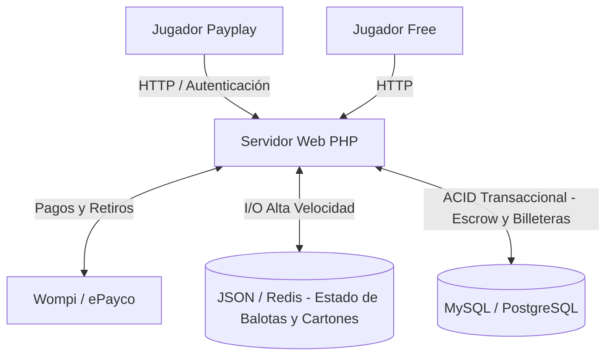

# Documento de Especificación de Requisitos de Software (SRS)
## Proyecto: Sistema de Bingo Online Multijugador (V2.1 - Economía Virtual y Pagos CO)

---

**Estándar de referencia:** Adaptado de IEEE 830 / ISO/IEC/IEEE 29148  
**Versión del documento:** 2.1.0  
**Fecha:** Septiembre 2026  
**Estado:** Aprobado / Línea Base  
**Sistema objetivo:** Aplicación Web de Bingo Multijugador Híbrida (`bingo_mod_v2`)

---

## 1. Introducción

### 1.1 Propósito
El presente documento define los requisitos para la versión **2.1.0** del sistema **Bingo Online Multijugador**. Esta actualización transforma la plataforma lúdica en un ecosistema transaccional mediante la inclusión de un **modo Payplay** (apuestas con dinero real convertido a fichas virtuales), un **sistema KYC** de verificación por niveles, y la integración con pasarelas de pago colombianas (**Wompi/ePayco**) para la gestión segura del flujo de caja.

### 1.2 Alcance del Sistema
El sistema soportará dos modalidades simultáneas:
- **Modo Gratuito (Free-to-play):** Salas efímeras sin registro obligatorio, creadas mediante alias.
- **Modo Payplay:** Salas con costo de entrada (*Buy-in*) que generan un pozo de premios (*Prize Pool*). Requiere registro, saldo en billetera y opera bajo un modelo de integridad transaccional (RDBMS) combinado con retención temporal de fondos (*Escrow*).

### 1.3 Definiciones, Acrónimos y Abreviaturas
- **Ficha / Token:** Unidad de valor de la plataforma (Ej: 1 Ficha = 1 COP o 1,000 COP).
- **Buy-in:** Costo de entrada a una sala Payplay.
- **Prize Pool:** Pozo de premios (Suma de Buy-ins menos la comisión).
- **Rake:** Comisión de la plataforma por organizar la partida (establecido por defecto en 10%).
- **Escrow (Saldo Retenido):** Estado temporal de los fondos de un jugador mientras está en la sala de espera de una partida Payplay, garantizando que tiene fondos pero sin cobrarlos definitivamente hasta que inicie el juego.
- **KYC (Know Your Customer):** Proceso de verificación de identidad para prevención de fraude y lavado de activos.
- **Webhook:** Petición HTTP POST enviada por la pasarela de pagos al servidor para notificar el estado de una transacción.

---

## 2. Descripción General del Producto

### 2.1 Arquitectura Híbrida (Estado y Transacciones)
Para balancear la alta frecuencia de actualización del juego en vivo (cada 2.5s) con la rigidez necesaria para manejar dinero real, el sistema utiliza un enfoque híbrido:



### 2.2 Niveles de Verificación de Usuario (KYC)
- **Nivel 0 (Básico):** Registro con Email/Password. Acceso exclusivo al modo Gratuito.
- **Nivel 1 (Identidad Verificada):** Confirmación vía OTP por email. Habilita recargas de fichas (PSE, Nequi, Daviplata, Tarjetas) y participación en salas Payplay.
- **Nivel 2 (Financiero / Retiros):** Requiere carga de documento (CC/CE) y certificación bancaria. Obligatorio para solicitar retiros de ganancias.

---

## 3. Requisitos de Interfaces Externas

### 3.1 Interfaces de Usuario (UI/UX)
1. **Pantalla de Inicio (`index.php`):**
   - Toggle/Switch para seleccionar Modo Gratuito o Modo Payplay al crear sala.
   - En Payplay, incluye un selector de Buy-in (ej. 1K, 5K, 10K, 50K Fichas).
2. **Panel de Usuario y Billetera (`wallet.php`):**
   - Indicadores de Saldo: Saldo Disponible vs. Saldo Retenido (En Juego / Escrow).
   - Módulo de Recarga: Integración del widget Checkout de Wompi/ePayco.
   - Módulo de Retiros: Formulario bloqueado si el usuario no es Nivel 2.
   - Historial paginado de movimientos contables.
3. **Panel de Verificación (`perfil.php`):**
   - Interfaz para subir documentos KYC y validar token OTP.
4. **Sala de Espera y Juego (`espera.php` y `juego.php`):**
   - Visor en vivo del Pozo Acumulado (*Prize Pool*) recalculado dinámicamente.

### 3.2 Endpoints (API REST) Adicionales

| Endpoint | Método | Acción |
| :--- | :--- | :--- |
| `php/auth/registro.php` | `POST` | Registro y envío de OTP (Nivel 0). |
| `php/auth/verificar.php` | `POST` | Validación OTP para ascenso a Nivel 1. |
| `php/pagos/checkout.php` | `POST` | Firma petición y genera hash para widget de pago. |
| `php/pagos/webhook.php` | `POST` | Recibe confirmación de la pasarela, valida firma y acredita. |
| `php/pagos/retiro.php` | `POST` | Crea solicitud de retiro (Requiere Nivel 2). |
| `php/billetera_acciones.php` | `POST` | Operaciones de billetera y estado KYC en capa unificada. |

---

## 4. Requisitos Funcionales

### Módulo 1: Billetera y Pagos (Integración ePayco/Wompi)
- **RF-14: Recargas por Webhook.** Al recibir un evento `APPROVED` de la pasarela, el sistema convierte el monto a fichas y suma el valor a `saldo_disponible`.
- **RF-15: Validación Criptográfica (Anti-Fraude).** Todo webhook entrante valida su autenticidad reconstruyendo el Hash/Checksum (SHA-256) con la Llave Secreta de Eventos mediante `hash_equals()`.
- **RF-16: Idempotencia de Transacciones.** El sistema verifica en la base de datos que la `referencia_pasarela` no exista antes de procesar el saldo para prevenir el doble gasto.
- **RF-17: Solicitud de Retiros.** Usuarios Nivel 2 pueden solicitar retiros. El monto se descuenta inmediatamente de `saldo_disponible` y pasa a estado `solicitudes_retiro = PENDIENTE` para desembolso manual.

### Módulo 2: Mecánica de Apuestas (Ciclo Escrow)
- **RF-18: Retención (Fase 1).** Al unirse a una sala Payplay, el Buy-in se debita de `saldo_disponible` y se acredita a `saldo_retenido`.
- **RF-19: Cobro de Buy-in (Fase 2).** Al iniciar la partida, el Host desencadena la consolidación: todos los `saldos_retenidos` de los participantes se convierten en cero, y la suma alimenta el `pozo_total` de la sala.
- **RF-20: Reembolso (Fase 3).** Si un jugador abandona el lobby, su Buy-in retorna a `saldo_disponible`. Si la sala se cancela antes de arrancar, el sistema hace rollback masivo a todos los conectados.
- **RF-21: Reparto de Premios (Fase 4).** Al confirmarse un Bingo válido:
  $$\text{Pozo Neto} = (\text{Participantes} \times \text{Buy-In}) \times (1 - 0.10)$$
  *(El 10% es el Rake de la plataforma)*. Si hay un empate en la misma balota, el Pozo Neto se divide equitativamente. El premio se transfiere automáticamente al `saldo_disponible` del ganador/es.
- **RF-22: Límite y Desconexión.** Se permite estrictamente 1 cartón por jugador por sala Payplay. Si el jugador se desconecta en curso, su cartón se evalúa en el servidor de forma automática. Si gana, recibe el premio en su billetera.

---

## 5. Requisitos No Funcionales (NFR)
- **S-05 (Bloqueo Transaccional):** Toda manipulación de saldo ocurre dentro de una transacción con bloqueo explícito de fila (`SELECT saldo FROM billeteras WHERE usuario_id = X FOR UPDATE`).
- **S-06 (Libro Mayor Append-Only):** La tabla `transacciones` es inmutable. No se permite realizar `UPDATE` o `DELETE` sobre registros históricos. Los errores se corrigen con asientos de reversión (`tipo = 'REEMBOLSO'`).
- **S-07 (Whitelisting IPs):** El endpoint `webhook.php` está restringido a nivel de servidor para aceptar únicamente tráfico desde IPs documentadas de Wompi o ePayco.
- **M-03 (Performance JSON):** La mecánica de marcado de casillas y extracción de balotas no consulta la base de datos relacional, operando sobre JSON/Redis para garantizar respuestas menores a 80ms durante el polling.

---

## 6. Modelo de Datos (Esquema Relacional)

```sql
-- Usuarios
CREATE TABLE usuarios (
    id INT AUTO_INCREMENT PRIMARY KEY,
    nickname VARCHAR(30) NOT NULL,
    email VARCHAR(255) UNIQUE NOT NULL,
    password_hash VARCHAR(255) NOT NULL,
    nivel_verificacion INT DEFAULT 0, -- 0: Basico, 1: OTP, 2: Documental
    documento_identidad VARCHAR(50) NULL,
    fecha_registro TIMESTAMP DEFAULT CURRENT_TIMESTAMP
);

-- Verificaciones KYC
CREATE TABLE verificaciones_kyc (
    id INT AUTO_INCREMENT PRIMARY KEY,
    usuario_id INT NOT NULL,
    token_otp VARCHAR(6) NULL,
    estado ENUM('PENDIENTE', 'APROBADO', 'RECHAZADO') DEFAULT 'PENDIENTE',
    tipo_documento ENUM('CC', 'CE') DEFAULT 'CC',
    archivo_documento VARCHAR(255) NULL,
    archivo_cert_bancaria VARCHAR(255) NULL,
    fecha_solicitud TIMESTAMP DEFAULT CURRENT_TIMESTAMP,
    FOREIGN KEY (usuario_id) REFERENCES usuarios(id)
);

-- Billeteras
CREATE TABLE billeteras (
    id INT AUTO_INCREMENT PRIMARY KEY,
    usuario_id INT UNIQUE NOT NULL,
    saldo_disponible DECIMAL(12,2) DEFAULT 0.00,
    saldo_retenido DECIMAL(12,2) DEFAULT 0.00, -- Fondos en Escrow
    fecha_actualizacion TIMESTAMP DEFAULT CURRENT_TIMESTAMP ON UPDATE CURRENT_TIMESTAMP,
    FOREIGN KEY (usuario_id) REFERENCES usuarios(id)
);

-- Transacciones (Libro Mayor Inmutable)
CREATE TABLE transacciones (
    id INT AUTO_INCREMENT PRIMARY KEY,
    usuario_id INT NOT NULL,
    tipo ENUM('RECARGA', 'RETIRO', 'BUY_IN', 'PREMIO', 'REEMBOLSO') NOT NULL,
    monto DECIMAL(12,2) NOT NULL,
    saldo_resultante DECIMAL(12,2) NOT NULL,
    referencia_pasarela VARCHAR(255) NULL,
    descripcion VARCHAR(255) NULL,
    fecha_creacion TIMESTAMP DEFAULT CURRENT_TIMESTAMP,
    FOREIGN KEY (usuario_id) REFERENCES usuarios(id)
);

-- Salas Payplay
CREATE TABLE salas_payplay (
    id INT AUTO_INCREMENT PRIMARY KEY,
    codigo_sala VARCHAR(4) UNIQUE NOT NULL,
    host_id INT NOT NULL,
    buy_in DECIMAL(10,2) NOT NULL,
    comision_pct DECIMAL(5,2) DEFAULT 0.10,
    pozo_total DECIMAL(12,2) DEFAULT 0.00,
    estado_financiero ENUM('ABIERTA', 'COBRADA', 'REPARTIDA', 'REEMBOLSADA') DEFAULT 'ABIERTA',
    fecha_creacion TIMESTAMP DEFAULT CURRENT_TIMESTAMP,
    FOREIGN KEY (host_id) REFERENCES usuarios(id)
);

-- Solicitudes de Retiro
CREATE TABLE solicitudes_retiro (
    id INT AUTO_INCREMENT PRIMARY KEY,
    usuario_id INT NOT NULL,
    monto DECIMAL(12,2) NOT NULL,
    datos_bancarios_json TEXT NOT NULL,
    estado ENUM('PENDIENTE', 'PROCESANDO', 'COMPLETADO', 'RECHAZADO') DEFAULT 'PENDIENTE',
    fecha_solicitud TIMESTAMP DEFAULT CURRENT_TIMESTAMP,
    FOREIGN KEY (usuario_id) REFERENCES usuarios(id)
);
```
